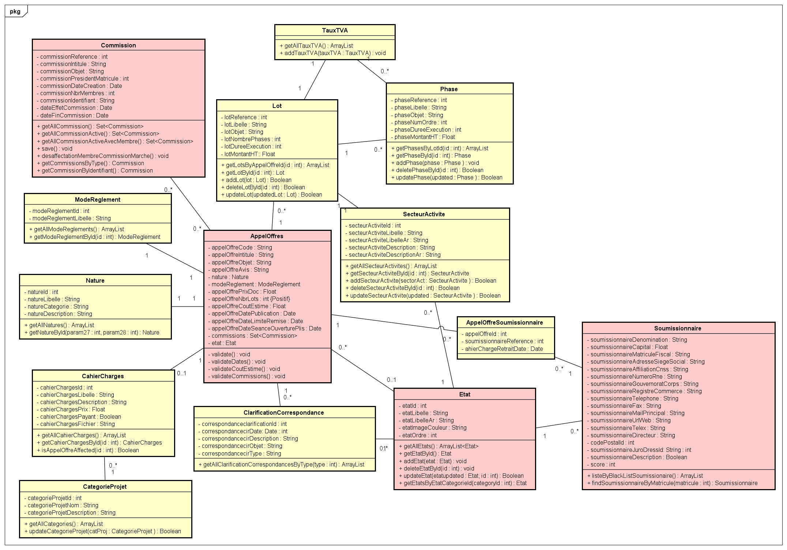
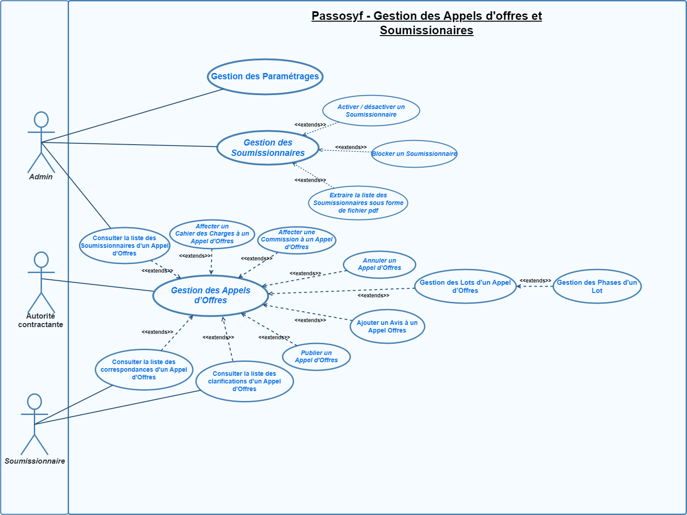

# 📘 Passosyf - Refonte Génie Logiciel

## 🔎 Description générale

**Passosyf** (Plateforme d'Aide à la Sélection de Soumissionnaires et à l'Organisation de la Passation des Marchés Publics/Privés) est une application web dédiée à la gestion du cycle de vie des appels d'offres dans les secteurs public et privé.

Ce projet fait partie d'une **refonte structurelle et logique** dans le cadre du module **Génie Logiciel**, visant à appliquer les bonnes pratiques suivantes :

- Les principes **SOLID**
- Les patrons de conception **GoF** (création, structure, comportement)
- Les patrons **GRASP**
- Les contraintes **OCL**
- Un **diagramme de classe** bien structuré
- Un **modèle conceptuel de données (MCD)**
- Des tests unitaires de validation métier

## 💡 Objectifs pédagogiques

Les objectifs principaux de ce projet sont :

- Structurer une application en couches indépendantes et bien organisées
- Appliquer les principes et les patrons de conception GoF et GRASP
- Rendre l'architecture ouverte à l'extension, mais fermée à la modification (OCP)
- Mettre en place des validations métier via OCL pour garantir l'intégrité des données
- Créer un diagramme de classes représentant les entités du système
- Générer automatiquement du code à partir des diagrammes de classes et du MCD
- Effectuer une **cross-évaluation** entre les projets des autres groupes
- Préparer une **pré-soutenance technique**

## 🛠️ Technologies utilisées

- **Backend** : Spring Boot, Java
- **Base de données** : MySQL
- **Modélisation** : UML, OCL
- **Version Control** : Git

## 📂 Structure du projet

### Répertoires principaux :

- **/src/main/java** : Code source principal
- **/src/test/java** : Tests unitaires
- **/docs** : Documentation technique, diagrammes, et rapports
- **/models** : Diagrammes UML, MCD, générés automatiquement

### Tâches et responsabilités par membre :

- **Chedly CHAHED** : Responsable de la gestion des appels d'offres (branch `Chedly-CHAHED-PassosyfApplication-corrections` et `Chedly-CHAHED-AppelOffres-corrections`)
- **Mohamed Chedly KLAA** : Application des patrons GoF (branches `KLAA-GOF`, `KLAA-GRASP`, `KLAA-SOLID`)
- **Amal BEN DJEMAA** : Application des patrons GRASP, SOLID et des contraintes OCL (branches `Gof_AMAL`, `Grasp_Amal`, `SOLID_AMAL`)

## 📝 Spécifications et fonctionnalités

L'application vise à gérer tout le cycle de vie des appels d'offres. Voici les fonctionnalités principales :

1. **Gestion des appels d'offres** : Création, modification, suppression des appels d'offres.
2. **Sélection des soumissionnaires** : Critères de sélection, analyse des offres.
3. **Gestion des documents** : Téléchargement et gestion des documents associés aux appels d'offres.
4. **Suivi de l'état** : Suivi des différentes étapes du processus d'appel d'offres.

### Diagrammes :

- **Diagramme de classe initial** :
  

- **Diagramme de cas d'utilisation** :
  

## 🔧 Comment exécuter le projet

### Prérequis

Avant de pouvoir exécuter l'application, assurez-vous que les éléments suivants sont installés :

- **JDK 17** ou supérieur
- **MySQL** avec une base de données configurée
- **Maven** pour la gestion des dépendances
- **Git** pour le contrôle de version

### Étapes pour démarrer

1. **Clonez le repository** :

   ```bash
   git clone https://github.com/your-repo/Passosyf.git
   cd Passosyf
   ```

2. **Configurez la base de données MySQL** :
   - Créez une base de données `passosyf_db`
   - Mettez à jour le fichier `application.properties` avec les informations de connexion à votre base de données.

3. **Construisez le projet** :

   ```bash
   mvn clean install
   ```

4. **Démarrez l'application** :

   ```bash
   mvn spring-boot:run
   ```

5. Accédez à l'application via `http://localhost:8080`.

## 📚 Références

- **Patrons de conception GoF** : *Design Patterns: Elements of Reusable Object-Oriented Software* par Erich Gamma, Richard Helm, Ralph Johnson, John Vlissides.
- **Principes SOLID** : *The Clean Code* par Robert C. Martin.
- **Patrons GRASP** : *Applying UML and Patterns* par Craig Larman.
- **OCL (Object Constraint Language)** : *OCL 2.0 - The Complete Guide* par Jos Warmer, Anneke Kleppe.

## 🌐 Liens utiles

- **GitHub repository** : [Passosyf - GitHub](https://github.com/your-repo/Passosyf)
- **Branches** :
  - `Chedly-CHAHED-PassosyfApplication-corrections` (Chedly CHAHED)
  - `Chedly-CHAHED-AppelOffres-corrections` (Chedly CHAHED)
  - `KLAA-GoF` (Mohamed Chedly KLAA)
  - `KLAA-GRASP` (Mohamed Chedly KLAA)
  - `KLAA-SOLID` (Mohamed Chedly KLAA)
  - `GoF_Amal` (Amal BEN DJEMAA)
  - `GRASP_Amal` (Amal BEN DJEMAA)
  - `SOLID_AMAL` (Amal BEN DJEMAA)

---

### Mise à jour réalisée par :

- **Chedly CHAHED**
- **Mohamed Chedly KLAA**
- **Amal BEN DJEMAA**
