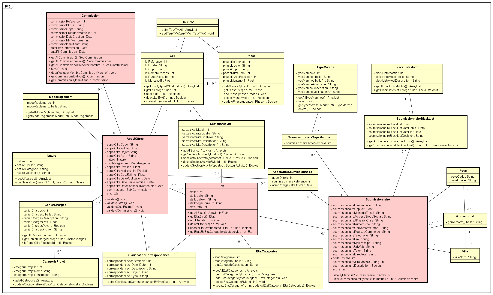
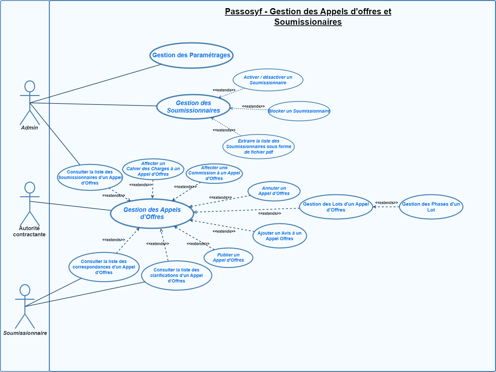

# 📘 Passosyf - Refonte Génie Logiciel

> ⚠️⚠️⚠️  
> **IMPORTANT : Toutes les modifications et améliorations (patrons de conception, SOLID, GRASP, OCL, refactoring) sont réparties dans les branches spécifiques !**  
> Merci de consulter les branches correspondantes pour chaque type de mise à jour.  
> ⚠️⚠️⚠️

---

## 🔎 Description générale

**Passosyf** (Plateforme d'Aide à la Sélection de Soumissionnaires et à l'Organisation de la Passation des Marchés Publics/Privés) est une application web dédiée à la gestion du cycle de vie des appels d'offres dans les secteurs public et privé.

Ce projet s'inscrit dans le cadre du module **Génie Logiciel** et vise à illustrer l'application concrète des bonnes pratiques suivantes :

- Les principes **SOLID**
- Les patrons de conception **GoF** (création, structure, comportement)
- Les patrons **GRASP**
- Les contraintes **OCL**
- Un **diagramme de classe** bien structuré
- Un **modèle conceptuel de données (MCD)**

---

## 💡 Objectifs pédagogiques

- Appliquer les bonnes pratiques de conception logicielle
- Rendre l'architecture robuste, extensible, et maintenable
- Illustrer l'intérêt de l'architecture en couches
- Modéliser et générer du code à partir de diagrammes UML
- Implémenter des validations métier avec OCL
- Réaliser une **pré-soutenance technique**
- Participer à une **cross-évaluation** entre projets

---

## 🛠️ Technologies utilisées

- **Backend** : Spring Boot, Java
- **Base de données** : MySQL
- **Modélisation** : UML, OCL, StarUML
- **Tests** : JUnit, Mockito
- **Documentation** : Swagger, PlantUML
- **Version Control** : Git + GitHub

---

## 📂 Architecture du projet

```bash
📁 PROJET GL
├── .mvn/
├── models/                     # Modèles conceptuels (MCD, etc.)
├── src/
│   └── main/
│       ├── java/
│       │   └── com.xtensus.passosyf/
│       │       ├── controllers/       # Contrôleurs REST (GRASP Controller)
│       │       ├── entities/          # Entités JPA + OCL (Expert, Cohésion forte)
│       │       ├── exceptions/        # Gestion des erreurs
│       │       ├── repositories/      # Interfaces JPA
│       │       ├── services/          # Interfaces des services métiers
│       │       ├── servicesImpl/      # Implémentations (Façade, SRP, DIP)
│       │       └── PassosyfApplication.java  # Point d'entrée (Singleton, Façade)
│       └── resources/
│           └── application.properties
├── test/                      # Tests unitaires et d'intégration
├── target/                    # Répertoire de compilation Maven
├── pom.xml                    # Configuration du projet Maven
└── README.md                  # Documentation complète du projet
```

---

## 📝 Spécifications et fonctionnalités

- 🔹 **Appels d'offres** : Création, mise à jour, suppression, validation.
- 🔹 **Sélection des soumissionnaires** : Analyse des offres et critères d'éligibilité.
- 🔹 **Suivi de l'état** : Avancement, états, notifications.
- 🔹 **Documents** : Gestion documentaire associée aux appels d'offres.

### Diagrammes

- 📘 **Diagramme de classes (initial)** :  
  

- 🎯 **Diagramme des cas d'utilisation** :  
  

---

## 👥 Membres et branches associées

| 👤 Membre                | 🌿 Branches associées |
|-------------------------|----------------------|
| **Chedly CHAHED**       | [Chedly-CHAHED-AppelOffres-corrections](https://github.com/OneEyeX/Projet-GL/tree/Chedly-CHAHED-AppelOffres-corrections)<br>[Chedly-CHAHED-PassosyfApplication-corrections](https://github.com/OneEyeX/Projet-GL/tree/Chedly-CHAHED-PassosyfApplication-corrections) |
| **Mohamed Chedly KLAA** | [KLAA-GoF](https://github.com/OneEyeX/Projet-GL/tree/KLAA-GoF)<br>[KLAA-GRASP](https://github.com/OneEyeX/Projet-GL/tree/KLAA-GRASP)<br>[KLAA-SOLID](https://github.com/OneEyeX/Projet-GL/tree/KLAA-SOLID) |
| **Amal BEN DJEMAA**     | [GoF_Amal](https://github.com/OneEyeX/Projet-GL/tree/GoF_Amal)<br>[GRASP_Amal](https://github.com/OneEyeX/Projet-GL/tree/GRASP_Amal)<br>[SOLID_AMAL](https://github.com/OneEyeX/Projet-GL/tree/SOLID_AMAL) |

> 🔁 Chaque branche contient des correctifs ou refactorings spécifiques (GoF, SOLID, GRASP, OCL). Veuillez les consulter séparément pour explorer les apports individuels.

---

## 🔧 Démarrage du projet

### Prérequis

- Java JDK 17+
- MySQL
- Maven
- Git

### Étapes

```bash
# 1. Cloner le projet
git clone https://github.com/OneEyeX/Projet-GL.git
cd Projet-GL

# 2. Créer la base de données
# via phpMyAdmin ou client SQL : `CREATE DATABASE passosyf_db;`

# 3. Configurer la BDD dans src/main/resources/application.properties

# 4. Construire et exécuter
mvn clean install
mvn spring-boot:run

# 5. Accès via : http://localhost:8080
```

---

## 📚 Références

- **GoF Patterns** : *Design Patterns* - Gamma et al.
- **GRASP** : *Applying UML and Patterns* - Craig Larman
- **SOLID** : *Clean Code* - Robert C. Martin
- **OCL** : *OCL 2.0 Specification* - OMG

---

## 🌐 Liens utiles

- 📁 [Repository GitHub](https://github.com/OneEyeX/Projet-GL)
- 📸 [Diagrammes UML & MCD](./models)
- 📋 [Documentation technique complète](./)
